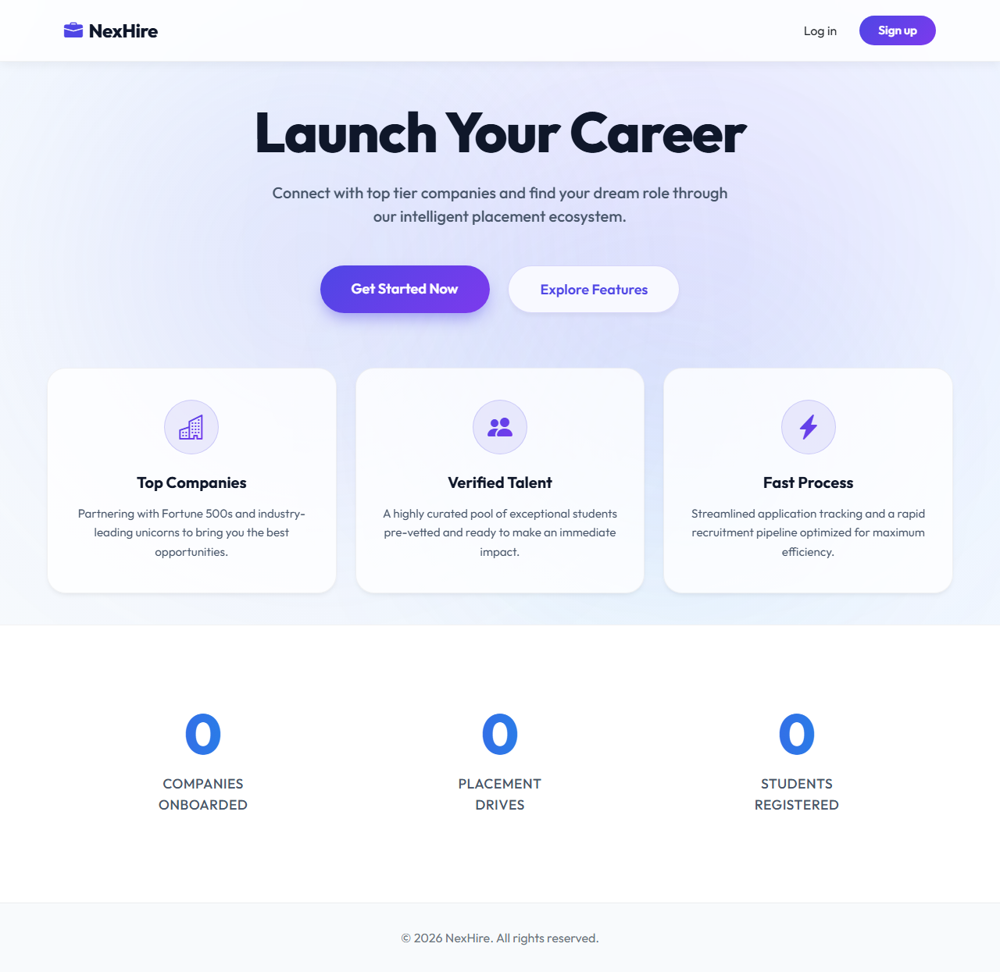
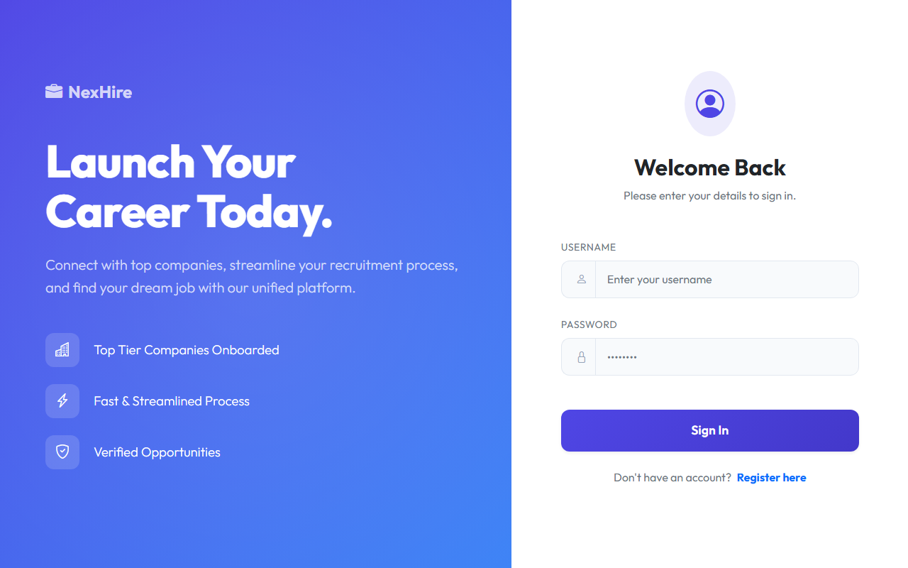
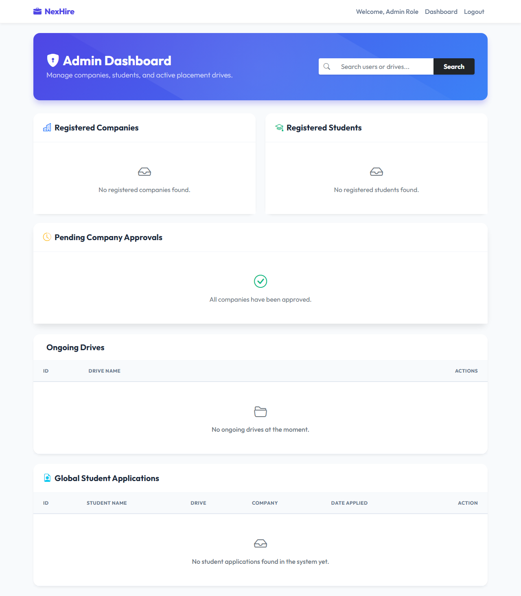

# NexHire - Intelligent Placement Portal

<div align="center">
  
</div>

<p align="center">
  <b>A modernized, fully responsive, and robust Placement Portal tailored for streamlining the placement process for students, companies, and administrators.</b>
</p>

<div align="center">
  
  
  
  
</div>

---

## 🌟 Overview

**NexHire** (formerly known as the IIT Madras Placement Portal) is an end-to-end recruitment platform. It connects top-tier companies with verified student talent through a fast, intelligent, and seamless recruitment ecosystem. With dedicated dashboards for different user roles, NexHire completely digitizes placement drives, tracking, and application management.

## 📸 Platform Highlights

### Professional Login & Registration
<div align="center">
  
</div>

### Comprehensive Admin Dashboard
<div align="center">
  
</div>

---

## 🚀 Key Features

### 👨‍💼 For Administrators
- **Company Management**: Approve or reject new company registrations.
- **Blacklisting**: Blacklist companies or students violating guidelines.
- **Real-time Analytics**: View comprehensive statistics on companies, active drives, and students.
- **Drive Moderation**: Mark placement drives as complete or inactive.

### 🏢 For Companies
- **Onboarding**: Seamless registration and approval pipeline.
- **Drive Creation**: Post jobs with role details, CGPA cutoffs, and package information.
- **Application Tracking**: Accept or reject student applications with ease.

### 🎓 For Students
- **Smart Discovery**: Browse active, approved placement drives.
- **Profile Matching**: View eligibility based on academic credentials (CGPA, department).
- **One-click Apply**: Apply to eligible drives and track application status.

---

## 🛠️ Tech Stack

- **Backend Framework**: Python / Flask
- **Database ORM**: Flask-SQLAlchemy (SQLite)
- **Authentication**: Flask-Login, Werkzeug (Scrypt hashing)
- **Frontend UI**: Bootstrap 5, Jinja2 Templates, Custom CSS (Glassmorphism UI)
- **Environment Management**: Python-dotenv

---

## 💻 Installation & Setup

1. **Clone the Repository**
   ```bash
   git clone https://github.com/Shashwatology/nexhire-mad1-project-iitm.git
   cd nexhire-mad1-project-iitm
   ```

2. **Set up a Virtual Environment (Recommended)**
   ```bash
   python -m venv venv
   source venv/bin/activate  # On Windows use: venv\Scripts\activate
   ```

3. **Install Dependencies**
   ```bash
   pip install -r requirements.txt
   ```

4. **Environment Setup (Optional)**
   Create a `.env` file in the root directory and configure your secret key:
   ```env
   SECRET_KEY=your_secure_secret_key_here
   ```

5. **Run the Application**
   ```bash
   python app.py
   ```
   > The application will automatically initialize the database `instance/placement.db` on its first run and create the default admin account.

6. **Access the Portal**
   Open your browser and navigate to: `http://127.0.0.1:5000`

---

## 🔑 Default Admin Credentials

Upon the very first execution, a default admin account is created:
- **Username**: `admin`
- **Password**: `admin`

*(It is highly recommended to change this in a production environment.)*

---

## 📁 Project Structure

```text
├── app.py                  # Main application entry point & DB initialization
├── config.py               # Application configuration settings
├── models.py               # Database schemas & relationship definitions
├── requirements.txt        # Python package dependencies
├── routes/                 # Blueprint modules for modular routing
│   ├── admin.py            # Admin-specific routes
│   ├── auth.py             # Authentication and registration logic
│   ├── company.py          # Company dashboard and drive logic
│   ├── student.py          # Student application and search logic
│   └── api.py              # API endpoints for analytics and data
├── templates/              # Jinja2 HTML templates
│   ├── base.html           # Base layout template
│   ├── landing.html        # Landing page UI
│   └── ...                 # Role-specific templates
└── static/                 # CSS stylesheets, JS, and Assets
```

---

<div align="center">
  <p>Built with ❤️ for transforming campus placements.</p>
</div>
